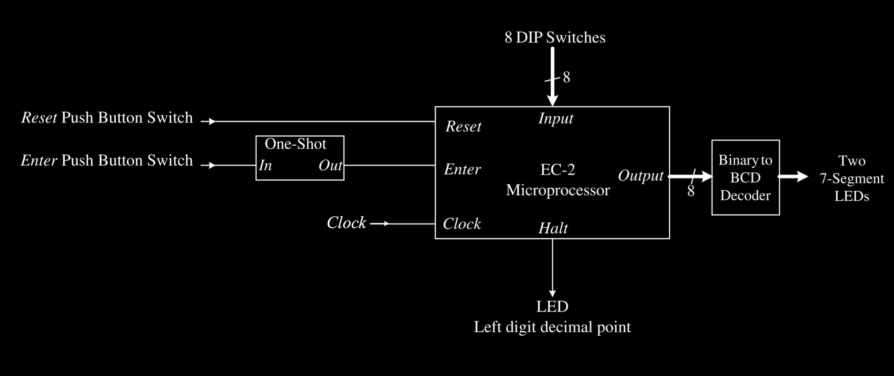
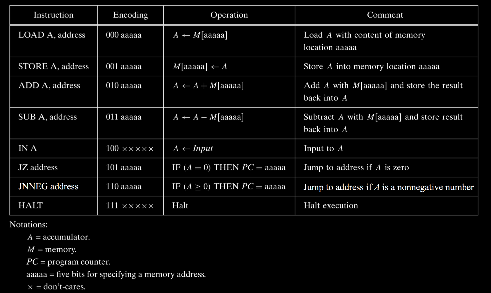

# EC2 Assembler #

## Preamble ##

* Date Created: Sept, 2015
* Version: 0.1
* Language: C++
* Requires: 
  * g++
  * Make

### Contributors ###
* James Christian Kauten (@Kautenja)

## Description 

The EC-2 (Enoch's Computer #2) is a toy microprocessor designed by [Enoch Hwang](https://lasierra.edu/computer-science/enoch-hwang/). The machine is purely for academic purposes and follows this hardware design:

This project aims to explore the process of assembling basic assembly level instructions written for the EC2 into binary code. The following instruction set architecture will be used in the implementation of this assembler following Enoch's original design:

After you've assembled some code, check out my [EC-2 Simulator](https://github.com/Kautenja/comp3350_EC2-Simulator) to simulate your program from the command line.

## Compilation ##

In a terminal in the root directory with the terminal type:

    g++ -o ec2Assembler main.cpp ASMFileReader.cpp BinaryFileWriter.cpp
  
  
## Execution ##
  
    ./ec2Assembler <assembly_file> <binary_file>
  
### Example ###

    ./ec2Assembler code.asm code.o

